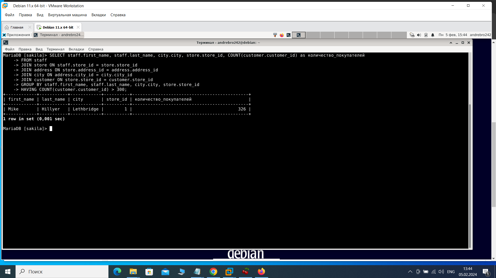
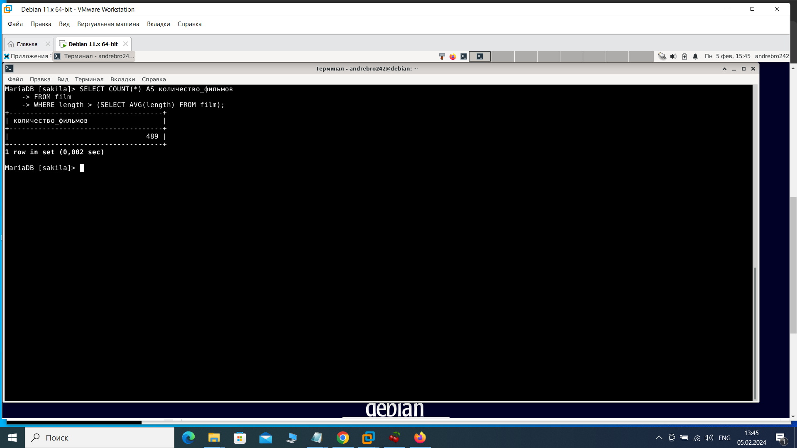
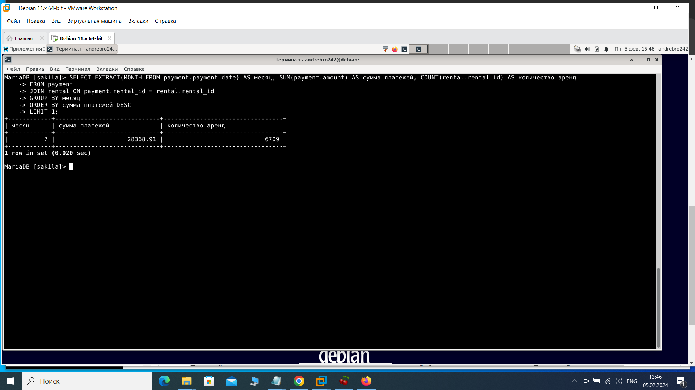
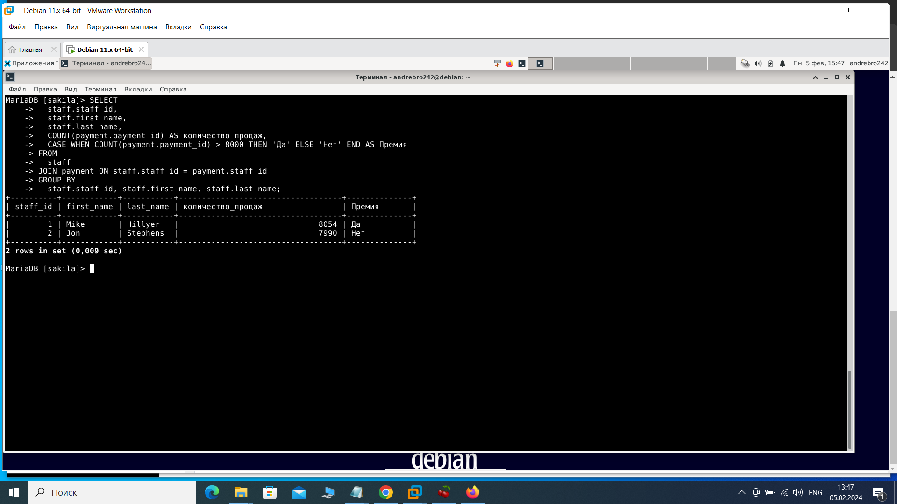
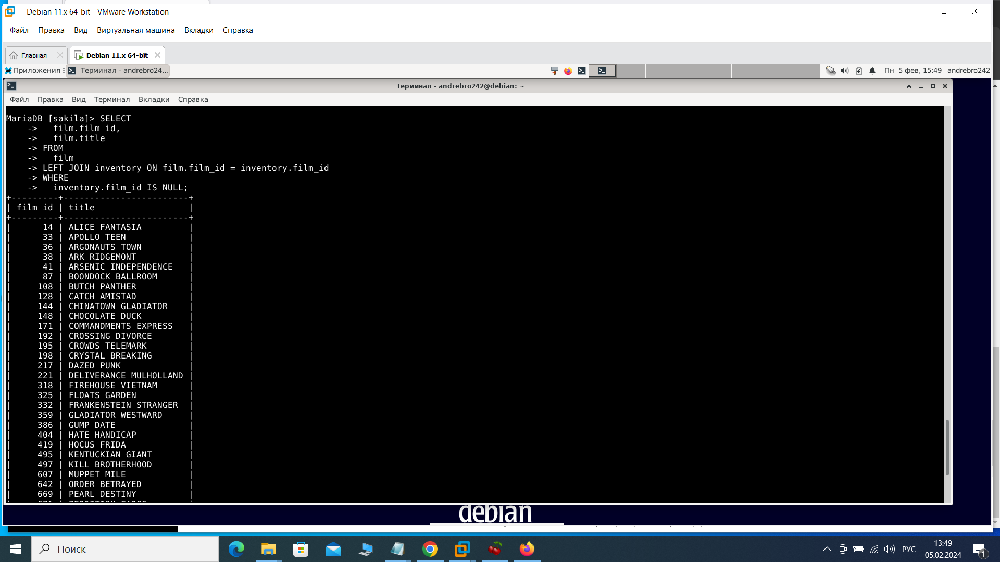

Домашнее задание к занятию «SQL. Часть 2» Брюхов А SYS-26

Задание 1

Одним запросом получите информацию о магазине, в котором обслуживается более 300 покупателей, и выведите в результат следующую информацию:

фамилия и имя сотрудника из этого магазина;
город нахождения магазина;
количество пользователей, закреплённых в этом магазине.

Решение 1:

    SELECT staff.first_name, staff.last_name, city.city, store.store_id, COUNT(customer.customer_id) as количество_покупателей
    FROM staff
    JOIN store ON staff.store_id = store.store_id
    JOIN address ON store.address_id = address.address_id
    JOIN city ON address.city_id = city.city_id
    JOIN customer ON store.store_id = customer.store_id
    GROUP BY staff.first_name, staff.last_name, city.city, store.store_id
    HAVING COUNT(customer.customer_id) > 300;

Задание 2

Получите количество фильмов, продолжительность которых больше средней продолжительности всех фильмов.

решение 2:

    SELECT COUNT(*) AS количество_фильмов
    FROM film
    WHERE length > (SELECT AVG(length) FROM film);

Задание 3

Получите информацию, за какой месяц была получена наибольшая сумма платежей, и добавьте информацию по количеству аренд за этот месяц.

Решение 3:

    SELECT EXTRACT(MONTH FROM payment.payment_date) AS месяц, SUM(payment.amount) AS сумма_платежей, COUNT(rental.rental_id) AS количество_аренд
    FROM payment
    JOIN rental ON payment.rental_id = rental.rental_id
    GROUP BY месяц
    ORDER BY сумма_платежей DESC
    LIMIT 1;

Задание 4*

Посчитайте количество продаж, выполненных каждым продавцом. Добавьте вычисляемую колонку «Премия». Если количество продаж превышает 8000, то значение в колонке будет «Да», иначе должно быть значение «Нет».

Решение 4:

    SELECT
      staff.staff_id,
      staff.first_name,
      staff.last_name,
      COUNT(payment.payment_id) AS количество_продаж,
      CASE WHEN COUNT(payment.payment_id) > 8000 THEN 'Да' ELSE 'Нет' END AS Премия
    FROM
      staff
    JOIN payment ON staff.staff_id = payment.staff_id
    GROUP BY
      staff.staff_id, staff.first_name, staff.last_name;

Задание 5*

Найдите фильмы, которые ни разу не брали в аренду.

Решение 5:

    SELECT
      film.film_id,
      film.title
    FROM
      film
    LEFT JOIN inventory ON film.film_id = inventory.film_id
    WHERE
      inventory.film_id IS NULL;

